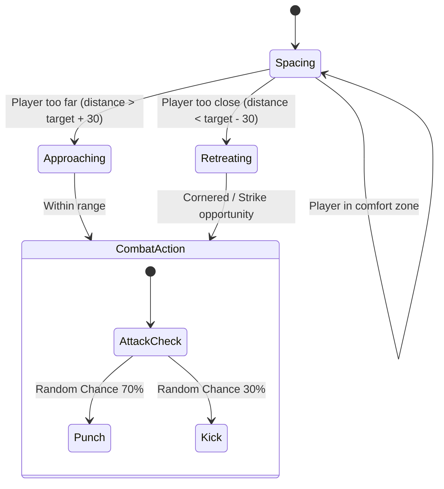

# 🥊 Fight Club — 2D Procedural Robot Combat Simulator

[](https://flutter.dev)
[](https://flame-engine.org)
[](https://pub.dev/packages/get)
[](https://firebase.google.com)
[](#-procedural-graphics--canvas-rendering)
[](LICENSE)

A high-performance, real-time 2D robot combat simulator built on top of the **Flame Game Engine** and **Flutter**. The game leverages a pure **GetX State Management Architecture** to decouple the game loop from responsive UI overlays, syncing statistics in real-time to a **Firebase Cloud Firestore** backend.

---

## 📖 Table of Contents
1. [Core Features](#-core-features)
2. [Procedural Graphics & Canvas Rendering](#-procedural-graphics--canvas-rendering)
3. [Game Physics & Combat Mechanics](#%EF%B8%8F-game-physics--combat-mechanics)
4. [Finite State Machine (FSM) AI](#-finite-state-machine-fsm-ai)
5. [Fighter Archetypes](#-fighter-archetypes)
6. [Architectural Blueprint](#-architectural-blueprint)
7. [Firebase Cloud Schema](#%EF%B8%8F-firebase-cloud-schema)
8. [Setup & Onboarding Guide](#%EF%B8%8F-setup--onboarding-guide)
9. [Senior Developer Guidelines & Performance Tips](#-senior-developer-guidelines--performance-tips)

---

## ✨ Core Features

*   **100% Asset-Free Procedural Rendering:** Visual components (fighters, limbs, shields, ground, and effects) are drawn dynamically on-the-fly using Flutter's hardware-accelerated vector canvas APIs. Highly optimized, extremely small bundle footprint, and infinitely scalable across all screen resolutions without quality loss.
*   **Stamina-Constrained Action Combat:** Tactical fighting mechanics requiring careful energy conservation. Offensive maneuvers deplete stamina, while idling and defensive postures regenerate it.
*   **Proximity-Aware AI System:** The AI behaves organically by evaluating and regulating the distance between itself and the player, alternating between spacing, approaching, jumping, and striking.
*   **Reactive UI Overlays:** In-game HUD components, healthbars, stamina meters, match records, and leaderboard lists sync in real-time via GetX streamable reactive variables (`obs`).
*   **Persistent Cloud Profile & Matches Sync:** Fully integrated authentication, profile progression (Level, XP, Fight Credits), Match Logs, and global real-time leaderboards powered by Firebase Authentication and Cloud Firestore.
*   **Real-time Remote Balancing Config:** Game administrators can tweak maximum health, attack strength modifiers, stamina costs, and credit reward parameters globally via a Firestore dynamic configuration document.

---

## 🎨 Procedural Graphics & Canvas Rendering

Rather than relying on resource-intensive sprite sheets and heavy texture atlases, `FightClubGame` employs procedural 2D vector painting inside the `RobotFighter.render()` pass. This architectural choice enables advanced visual features with zero bundle bloat:

*   **Canvas Translations & Matrix Flipping:** Fighters are rendered in their native coordinate systems, but dynamically transformed using translation matrices and scale reflections (`canvas.scale(-1, 1)`) to handle multi-directional combat orientation flawlessly.
*   **Dynamically Pulsing Cores:** The power core of each fighter pulses dynamically based on a sine wave synchronized with the game timeline (`gameRef.elapsedTime()`).
*   **Visor & Shield Glow Effects:** Rendered utilizing linear gradients and high-performance mask filters for glowing visor lights (`MaskFilter.blur(BlurStyle.normal, 3)`) and tactical energy shields (`LinearGradient`).
*   **Procedural Particle Systems (`ClashSpark`):** Impact hits dynamically generate vector sparks that scatter outwards and slowly fade over time, utilizing programmatic velocity and alpha-decay rendering inside the entity lifecycle.

---

## 🕹️ Game Physics & Combat Mechanics

```
               [ JUMPING ] 
             yVelocity < 0  ▲
                            │  custom gravity acceleration
                            ▼  (900 px/s²)
            ┌────────────────────────┐
            │   FIGHTER COLLIDER     │
            └────────────────────────┘
                    [ GROUND ]  yPosition == groundY
 ─── ─── ─── ─── ─── ─── ─── ─── ─── ─── ─── ─── ─── ─── ─── ─── ─── ───
```

The simulator models simplified 2D physics inside the Flame update cycle:

1.  **Custom Gravity Simulation:** Constant acceleration of `900 px/s²` applies when a fighter's vertical position exceeds the ground barrier, allowing for heavy, responsive jumping capabilities.
2.  **Directional Walk Cycles:** Walk cycles are procedurally modeled by matching standard trigonometric functions (`sin(walkCycle)`) to leg coordinates, rendering realistic joint motion dynamically.
3.  **Active Tactical Shielding:** Pressing and holding block reduces incoming damage by `75%` and overlays an energy barrier. However, shielding stops stamina regeneration.
4.  **Stamina Depletion Penalties:**
    *   **Punch:** Consumes `15 stamina`. Damage scale: `Strength × 1.0`.
    *   **Kick:** Consumes `25 stamina`. Damage scale: `Strength × 1.5` (Higher delay, extended range).
    *   Failing to meet stamina thresholds prevents action execution, requiring strategic spacing to regenerate stamina.
5.  **Dynamic Knockbacks & Camera Shaking:** Damage impact triggers knockbacks inversely proportional to the character's `bulk` rating and induces canvas-level viewfinder shakes (`ZigzagEffectController`) to add weight and raw impact to combat.

---

## 🤖 Finite State Machine (FSM) AI

The offline opponent is governed by an elegant proximity-based state machine, preventing monotonous AI behavior:



*   **Spacing State:** The AI utilizes sinusoidal oscillation movements to confuse the player while maintaining comfortable striking distance.
*   **Approaching/Retreating State:** Automatically steps forwards or backwards to regain tactical position.
*   **Probability-Driven Offensive Selection:** While inside tactical range, the AI randomly fires punches or kicks, mixed with occasional jumps to bypass the player's guard.

---

## 🛡️ Fighter Archetypes

Fighters are generated from the `CharacterStats` model, modifying physical sizing ratios (`bulk`), baseline health pools, movement speed, and stamina specs:

| Archetype Name | Base Health | Base Stamina | Agility (Speed) | Torso Scale (`bulk`) | Physical Description & Combat Style |
| :--- | :---: | :---: | :---: | :---: | :--- |
| **Speed Fighter** | `80` | `120` | `25` | `0.8x` | Fast and highly agile. Regenerates stamina quickly, but extremely fragile on impacts. |
| **Strength Fighter**| `100` | `100` | `15` | `1.0x` | Balanced power, defense, and stamina management. Traditional all-rounder. |
| **Tank Fighter** | `150` | `80` | `10` | `1.4x` | Enormous health reserve, heavily resistant to knockbacks, but sluggish velocity. |

---

## 🏢 Architectural Blueprint

The project is engineered according to a clean separation of concerns, decoupling structural Flutter UI, game loop pipelines, state management controllers, and database engines.

```
lib/
├── main.dart                      # App entry point, GetX configuration, theme declaration
├── firebase_options.dart          # Automated Firebase client platform registration
│
├── controllers/                   # GetX State Controllers (Reactive State & Stream Bindings)
│   ├── auth_controller.dart       # User auth status streams, sign-in/up, profile hydration
│   ├── database_controller.dart   # Live Firestore streams (leaderboards, remote balancing config)
│   └── game_controller.dart       # Core game HUD reactive streams (health, stamina, match states)
│
├── game/                          # Flame Game Engine Core
│   └── fight_club_game.dart       # FightClubGame framework, RobotFighter components, physics
│
├── models/                        # Plain Dart Models & Object Mappings
│   ├── character_stats.dart       # Fighter stats, base attributes, and presets
│   ├── match_data.dart            # Match history record mapping & accuracy calculations
│   └── user_profile.dart          # User demographic and dynamic gaming progress profile
│
├── screens/                       # Presentation layer widgets (GetView screens)
│   ├── admin_dashboard_screen.dart# Game balance manager for game configuration values
│   ├── auth_screen.dart           # Authentication gateway (login/registration toggle)
│   ├── character_selection_screen.dart # Visual selector cards for Fighter Archetypes
│   ├── combat_screen.dart         # Flame GameWidget integration overlayed with GetX reactive HUD
│   ├── home_screen.dart           # Primary menu, profile hub, matchmaking lobby
│   ├── leaderboard_screen.dart    # Live streaming Firestore global scoreboard
│   ├── match_result_screen.dart   # Accuracy computations, reward details, and rematch options
│   ├── profile_screen.dart        # Profile stats, rank thresholds, and match histories
│   ├── shop_screen.dart           # Credits-based upgrade and unlock store
│   └── splash_screen.dart         # Thematic intro and authentication route pre-fetcher
│
└── services/                      # Application Utility / Infrastructure Services
    └── reward_service.dart        # Accuracy-weighted algorithms for XP & fight credit payouts
```

---

## 🗄️ Firebase Cloud Schema

The application is structured to utilize three main collections inside Cloud Firestore.

### 1. `users` Collection
*   **Document ID:** `userId` (Corresponds to Firebase Auth `uid`)
```json
{
  "username": "NeonGladiator",
  "email": "gladiator@fightclub.com",
  "level": 3,
  "experiencePoints": 1250,
  "winCount": 12,
  "lossCount": 4,
  "fightCredits": 450,
  "lastLogin": "2026-05-18T06:45:00Z",
  "unlockedItems": ["heavy_visor_red", "carbon_plating"],
  "isAdmin": false
}
```

### 2. `matches` Collection
*   **Document ID:** Automatic UUID
```json
{
  "playerId": "auth_user_uid_12345",
  "characterUsed": "Speed Fighter",
  "outcome": "win",
  "totalHits": 18,
  "totalAttempts": 22,
  "xpEarned": 81,
  "creditsEarned": 181,
  "timestamp": "2026-05-18T06:51:30Z"
}
```

### 3. `config` Collection
*   **Document ID:** `combat_balance` (Used for real-time remote configuration updates)
```json
{
  "maxHealth": 100.0,
  "strengthMultiplier": 1.0,
  "staminaCost": 10.0,
  "rewardMultiplier": 1.0
}
```

---

## ⚙️ Setup & Onboarding Guide

### Prerequisites
*   [Flutter SDK](https://docs.flutter.dev/get-started/install) (`>= 3.11.5`)
*   [Firebase CLI Tool](https://firebase.google.com/docs/cli)
*   Dart `sdk` configured in environment path

### 1. Clone & Fetch Dependencies
```bash
# Clone the repository
git clone https://github.com/zeeshanakhtar012/Fight_Club.git
cd Fight_Club

# Clean build artifacts and get Flutter packages
flutter clean
flutter pub get
```

### 2. Firebase Project Initialization
Run the Firebase CLI configurations to bind your project environments:
```bash
# Authenticate with your Google Account
firebase login

# Initialize Flutterfire setup (Requires Node.js & Flutterfire CLI installed)
flutterfire configure
```
Select your active Firebase project. This will automatically update `lib/firebase_options.dart` and register platform configurations for iOS, Android, macOS, and Web.

### 3. Setup Firestore Remote Balancer Config
To ensure correct initialization, configure the default combat balance document:
1. Navigate to your **Firebase Console** -> **Firestore Database**.
2. Create a collection named `config`.
3. Add a document with ID `combat_balance` containing the following fields:
   *   `maxHealth` (number): `100.0`
   *   `strengthMultiplier` (number): `1.0`
   *   `staminaCost` (number): `10.0`
   *   `rewardMultiplier` (number): `1.0`

### 4. Running the Project
```bash
# Run local checks for layout and static analysis errors
flutter analyze

# Launch on connected mobile emulator, desktop target, or web simulator
flutter run
```

---

## 🧠 Senior Developer Guidelines & Performance Tips

To maintain code standards and seamless frame execution rates on low-end target systems, adhere strictly to these principles:

### ⚡ Game Loop Optimization Rules (Flame Component Lifecycle)
1.  **Strictly Avoid Allocation inside `update` / `render` passes:**
    *   Do **NOT** allocate `Paint`, `Rect`, `Path`, or `Vector2` instances within the update/render cycle. These trigger intense garbage collection (GC) thrashing, causing visible frame stutters.
    *   *Correction:* Define and instantiate static/final Paint configurations, Rect shells, and path builders inside `onLoad()` or class constructors, then mutate properties directly.
2.  **Avoid Raw Text Rendering in Game Engine:**
    *   Use Flame's `TextComponent` or leverage Flutter's `GetMaterialApp` UI overlays (via reactive widgets) to represent text. Custom layout paints inside the game engine run entirely on CPU and slow down frame rendering.
3.  **Correct State Decoupling Pattern:**
    *   Do not query UI elements directly from the `RobotFighter` or `FightClubGame` components.
    *   Update values inside `GameController.instance` reactive properties (`currentHealth.value = health`). GetX takes care of re-rendering overlay screens asynchronously outside the Flame thread.

### 🛠️ Static Verification
Always double-check your code against the analytical boundaries of the system prior to standard commits:
```bash
flutter format .
flutter analyze
```

---

## 📄 License
This project is licensed under the MIT License — see the [LICENSE](LICENSE) file for complete details.
